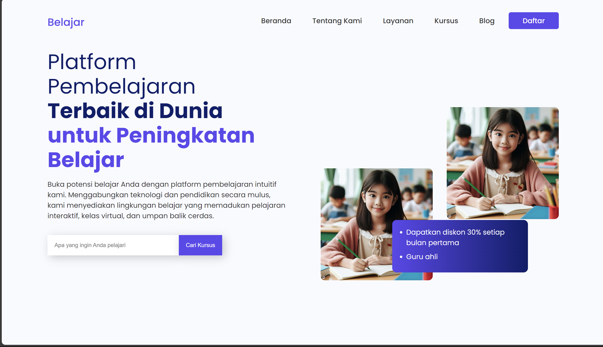

# Web Pembelajaran

Ini adalah bagian dari landing page untuk Website Pembelajaran. Bagian ini mencakup tata letak header dan footer.

## Header

Header adalah bagian atas dari halaman web yang berisi elemen-elemen navigasi dan informasi penting lainnya. Biasanya, header terletak di bagian atas setiap halaman web dan dapat berisi logo, menu navigasi, dan elemen-elemen lainnya.

### Komponen Header:

- **Logo**: Logo perusahaan atau merek terletak di bagian kiri atas header. Ini memberikan identitas visual bagi pengguna.
  
- **Menu Navigasi**: Menu navigasi berisi tautan-tautan ke halaman-halaman utama situs web. Ini memungkinkan pengguna untuk dengan mudah menjelajahi konten situs web.

- **Tombol Daftar**: Tombol daftar atau tautan untuk masuk ke akun pengguna. Ini memungkinkan pengguna untuk mengakses konten yang dibatasi atau untuk mengelola akun mereka.

## Footer

Footer adalah bagian bawah dari halaman web yang sering kali berisi informasi tambahan dan tautan-tautan yang berguna. Footer dapat mencakup informasi kontak, tautan ke halaman-halaman penting, dan hak cipta.

## Screenshot

## Teknologi yang Digunakan

- HTML
- CSS
